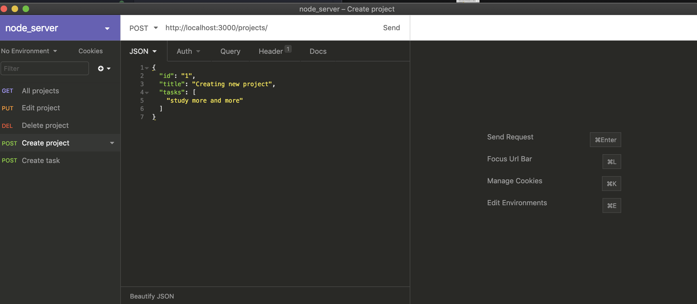
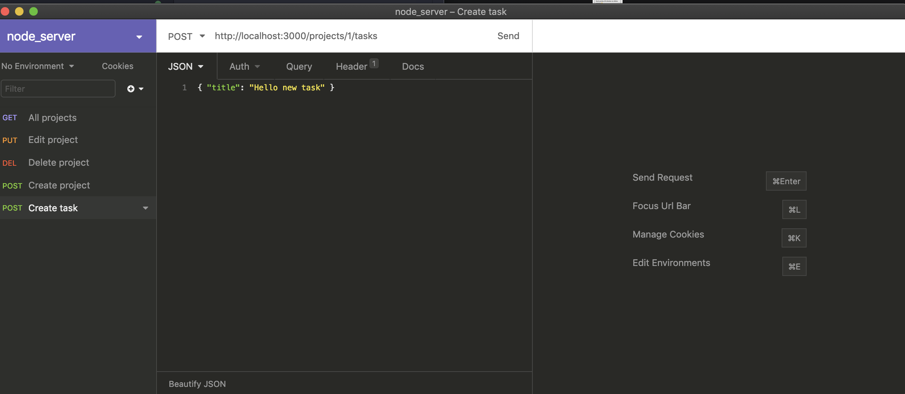
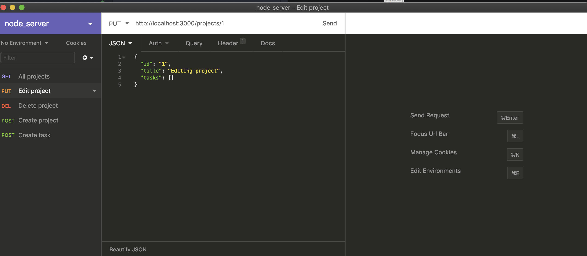
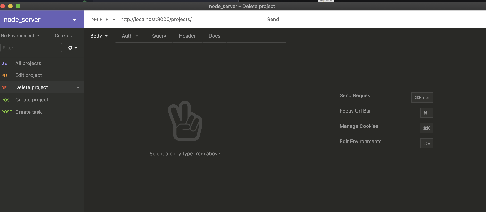

# Server with Node.js using Insomnia

Server with Node.js

## Starting

To start the project

```bash
yarn dev
```
## About 

Application to store projects and their tasks from scratch using Express.

### Routes
- ```GET / projects:``` lists all projects and their tasks;

- ```POST / projects:``` The route registers a new project.

- ```POST / projects /: id /``` tasks: The route stores a new task in the task array of a specific project chosen through the id present in the route parameters;

- ```PUT / projects /: id:``` The route only changes the title of the project with the id present in the parameters of the route;

- ```DELETE / projects /:``` id: The route deletes the project with the id present in the route parameters;


### Middlewares
Application with middleware used on all routes that received the project ID in the URL parameters, that verify that the project with that ID exists. When it does not exist, it returns an error, otherwise it allows the request to continue normally;

Global middleware called on every request that prints (console.log) a count of how many requests have been made in the application so far;

## Usage

To download Insomnia

Click here => [Insomnia](https://insomnia.rest/download/)

## Using Insomnia Examples








### Portuguese

Aplicação para armazenar projetos e suas tarefas do zero utilizando Express.

Rotas
- ```GET /projects:``` Rota lista todos projetos e suas tarefas;

- ```POST /projects:``` A rota cadastra um novo projeto.

- ```POST /projects/:id/tasks:``` A rota armazena uma nova tarefa no array de tarefas de um projeto específico escolhido através do id presente nos parâmetros da rota;

- ```PUT /projects/:id:``` A rota altera apenas o título do projeto com o id presente nos parâmetros da rota;

- ```DELETE /projects/:id:``` A rota deleta o projeto com o id presente nos parâmetros da rota;

### Middlewares
Aplicação com middleware utilizado em todas as rotas que receberam o ID do projeto nos parâmetros da URL que verifica se o projeto com aquele ID existe. Quando não existe retorna um erro, caso contrário permite a requisição continuar normalmente;

Middleware global chamado em todas requisições que imprime (console.log) uma contagem de quantas requisições foram feitas na aplicação até então;


## License
[MIT](https://choosealicense.com/licenses/mit/)